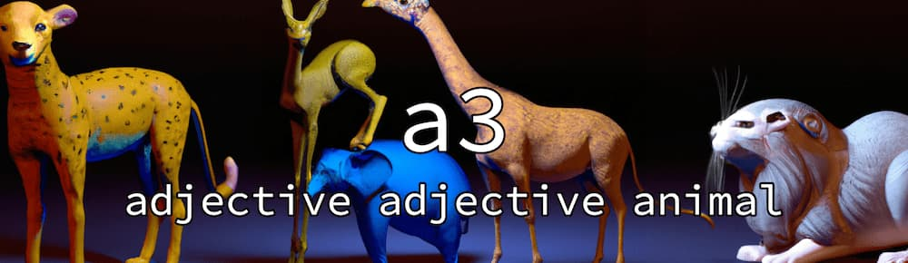

# Adjective Adjective Animal 


Cute slugs from the terminal in seconds. Random and reasonably unique human-readable ID strings using all the unique adjectives and animal names I could find online in 4 hours.

Greatly expands work done by a-type [here](https://github.com/a-type/adjective-adjective-animal).


## Usagé

1. Installation

    ```sh
    $ yarn global add elliotberry/adjective-adjective-animal
    ```

2. Scream in 2 da terminal:

   ```sh
    $ a3
    ```
